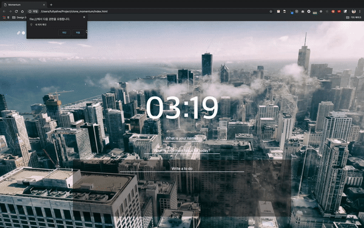

# **Customized Momentum**

Cloning momentum with Vanilla JS



## **Structure**

[flag-icon-css](http://flag-icon-css.lip.is/) - 전세계 국기 icon css

### **clock.js**

```
- 현재 시간 표시
```

### **weather.js**

```
- openweathermap.org로부터 api를 받아와 localStorage에 저장
- 날씨와 온도, 국가와 도시 출력
- 날씨에 따라 아이콘 출력, 국가에 따라 국기 출력
```

### **greeting.js**

```
- 유저로부터 네임을 입력받아 localStorage에 저장
- 유저네임을 업데이트
- clock.js에서 받아온 시간에 따라 인사말 다르게 출력
```

### **focus.js**

```
- 유저로부터 목표를 입력받아 localStorage에 저장
- 목표를 업데이트
```

### **todo.js**

```
- 할 일 등록(최신순으로 정렬)
- 할 일 수정
- 할 일 삭제
- 할 일이 없을 경우 박스 접기
```

### **background.js**

```
- 배경 이미지 랜덤 출력
```
